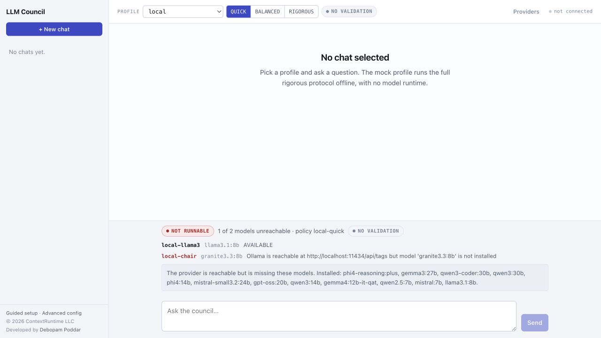

# LLM Council

[](https://github.com/debopampoddar/llm-council/actions/workflows/ci.yml)
[](https://openjdk.org/projects/jdk/25/)
[](https://spring.io/projects/spring-boot)
[](LICENSE)

**LLM Council is a Java/Spring Boot utility for asking models to reason through
a question without hiding the process behind one final answer.** It makes the
stages, disagreement, partial states, validation posture, cost signals, and
trust limits visible alongside the result.

It is for engineers who want to explore or build dependable multi-model
workflows—not simply put several model calls behind a voting prompt.



*The local `QUICK` health gate reports the separate Granite chair explicitly.
This current capture blocks Send because the required tag is missing—no fallback
or fabricated result is used. Once both roles are available, each answer carries
its stages, token use, call count, validation posture, and trust limits.*

## Start Here: Your First Local Run

You need Java 25, Maven 3.9 or newer, and a running
[Ollama](https://ollama.com/) service.

For the shipped local `QUICK` path, pull the drafting model and the separate
chair model:

```bash
ollama pull llama3.1:8b
ollama pull granite3.3:8b
```

Build and start the application:

```bash
mvn --batch-mode --no-transfer-progress clean verify
java -jar target/llm-council-2.0.2.jar
```

Open <http://127.0.0.1:8080>, choose **local** and **QUICK**, and ask one
bounded question. A useful first prompt is:

> We run a Java 25 payment API on Kubernetes. After a configuration deployment,
> p99 latency rose from 120 ms to 2.4 s while CPU and memory stayed flat.
> Rolling back restored p99 to 130 ms. Give the likely cause, the next three
> diagnostic checks in order, what evidence would falsify your diagnosis, and a
> safe rollout plan. Separate confirmed facts from assumptions.

Before reading the answer, read the timeline and trust strip. `QUICK` is a fast
first pass: it has no model-validation stage. Move to `BALANCED` or `RIGOROUS`
only after the fast path is healthy and you understand why the added calls are
worth the time and cost. `BALANCED` also needs `mistral:7b` and
`gemma4:12b-it-qat`; `RIGOROUS` additionally needs `qwen2.5:7b`.

## What Happens To A Question?

```text
question and context
  → independent drafts
  → anonymised review
  → scoring and disagreement checks
  → optional debate and revision
  → synthesis
  → Fresh Eyes validation
  → answer plus evidence
```

The chosen depth determines how much of that path runs:

| Depth | Use it when | What it does |
|---|---|---|
| `QUICK` | You want a fast, inspectable first pass. | Generate and synthesise. No model validation. |
| `BALANCED` | You want peer review and a validation stage. | Generate, anonymise, review, score, synthesise, validate. |
| `RIGOROUS` | The decision benefits from deeper, evidence-triggered deliberation. | `BALANCED` plus optional debate, revision, re-review, second scoring, and export metadata. |

Depth is a protocol and cost choice—not a claim that more model calls are
automatically more correct.

## Why Use LLM Council?

### See the reasoning process, not only the final text

The UI and APIs expose stage progress, model availability, warnings, retries,
partial states, preserved dissent, token usage, and latency. If a validator did
not run or does not provide an independent check, that is visible.

### Keep policy under application control

Callers select a named profile and depth. They cannot submit a raw protocol ID
to bypass quorum, validation, or cost controls. Models generate untrusted text;
application code owns the protocol and its guardrails.

### Configure a council that can actually run

The Guided setup page inventories installed local models and configured
providers, then creates a reviewable proposal. It does not invent model IDs or
write configuration until you confirm it.


### Make honest trade-offs visible

A model that failed, a partial quorum, missing dissent evidence, or a
non-independent validator should change how a result is used. LLM Council
surfaces those facts instead of presenting every completion as equally reliable.

## What This Is—and What It Is Not

| It is | It is not |
|---|---|
| A configurable, observable Java/Spring Boot multi-model workflow utility. | Proof that a council beats a strong one-call model. |
| Suitable for controlled local use, learning, and engineering demonstrations. | An authenticated, multi-tenant service for public deployment. |
| A system with layered context/data separation and bounded deterministic recovery. | Universal prompt-injection prevention or a source of factual truth. |
| An evaluation-ready project with a separate harness and clear limitations. | A green build that certifies model quality. |

The server binds to loopback by default. There is no authentication,
authorization, or user-level ownership model, so do not expose it to an
untrusted network.

## Where To Go Next

| If you want to… | Start here |
|---|---|
| Understand the stages, data flow, and extension points | [Library flow guide](docs/library-flow-guide.md) |
| Use cloud providers safely | [Cloud quick start](docs/cloud-quickstart.md) |
| Configure, observe, test, or extend the utility | [Operations and development guide](docs/operations-and-development-guide.md) |
| Call the service from another application | [HTTP API reference](docs/http-api-reference.md) |
| Run on an M1 or Intel Mac with Docker | [Documentation index](docs/README.md) |
| Understand security boundaries | [Prompt-injection threat model](docs/prompt-injection-threat-model.md) |
| Decide whether a shared deployment is appropriate | [Production-readiness plan](docs/production-readiness-plan.md) |
| See a real run and a walkthrough script | [Showcase and blog guide](docs/showcase-and-blog-guide.md) |

The [documentation index](docs/README.md) is the complete map. It distinguishes
current operational references from future decision records and historical
evidence.

## Evaluation: The Important Claim Boundary

The separate [LLM Council evaluation harness](https://github.com/debopampoddar/llm-council-evaluation)
compares the council with direct-model and same-model-ensemble baselines.

Historical local evidence did **not** demonstrate that `RIGOROUS` outperformed
those baselines. The run also informed later hardening, so it is diagnostic
history rather than confirmation of the current code. Future quality claims need
fresh held-out data, independent judges, and blinded human review.

That boundary is deliberate: the project is designed to make evidence and
uncertainty inspectable, not to hide them behind a fluent answer.

## Project Status

| Area | Current position |
|---|---|
| Local Ollama | `QUICK`, `BALANCED`, and `RIGOROUS` policies are implemented. |
| Cloud profiles | OpenAI, Anthropic, Gemini, two focused local/cloud hybrids, and multi-cloud profiles are implemented; repeatable live contract suites remain open. |
| Deterministic verification | Maven tests plus repository YAML, Markdown, and provider-configuration checks. |
| Shared/public use | Not ready: authentication, authorization, ownership, and distributed admission remain open. |

## Contribute And Verify

Run the repository checks before opening a pull request:

```bash
mvn --batch-mode --no-transfer-progress clean verify
./scripts/verify-repository.sh
```

For the Java package layout, metrics, Docker paths, configuration overlays, and
distribution notes, use the [operations and development guide](docs/operations-and-development-guide.md).

## License

This repository is licensed under the [GNU General Public License version 3](LICENSE).
The license file is authoritative.
