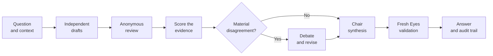
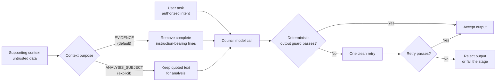
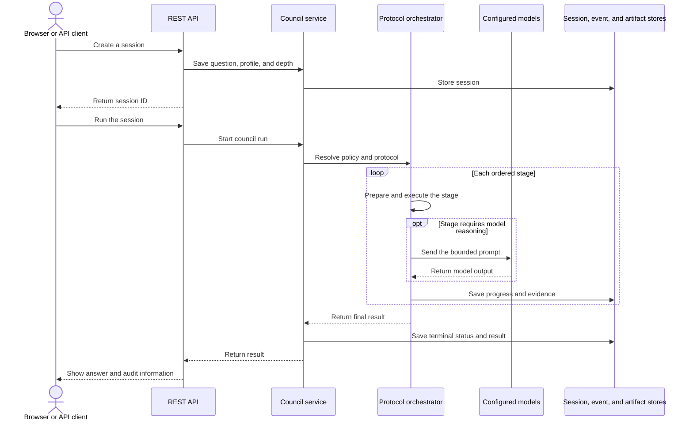
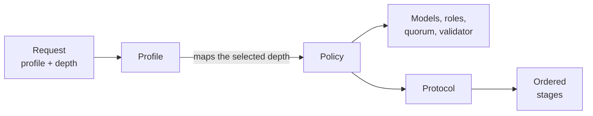
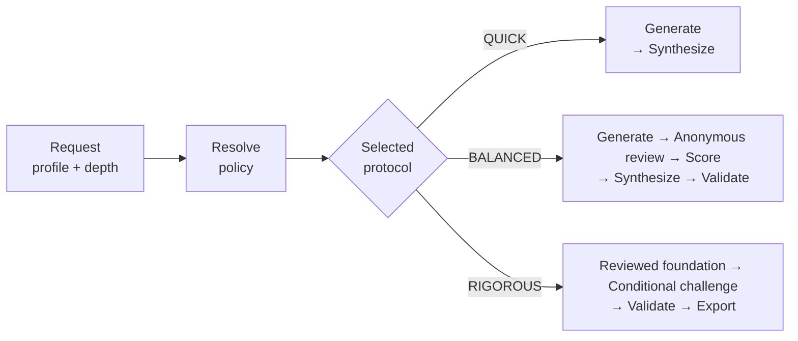
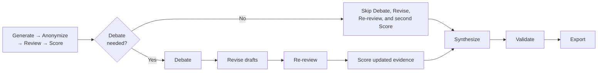
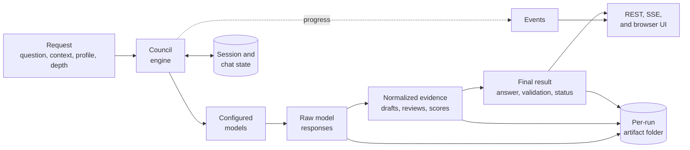

# LLM Council Library Flow Guide

This guide explains the LLM Council implementation in simple terms, then maps that explanation to the Java code.

> **Document role:** current technical reference. New users should first run the
> [quick local demo](../README.md#quick-local-demo); use this guide when you want
> to understand APIs, stages, artifacts, or extension points.

## Simple Mental Model

An LLM Council is a structured way to ask multiple models the same question and use their disagreement as evidence.

Instead of sending the question to one model and accepting one answer, the
council follows an inspectable decision path:



This is the full conceptual path. `QUICK` skips review and validation;
`BALANCED` stops before debate; `RIGOROUS` enters debate only when configured
conditions are met.

The goal is not to make models vote blindly. The goal is to make the evidence visible: what each model said, what reviewers found, which draft scored best, what dissent remains, and whether a separate validator approves the final answer.

The service now exposes two user-facing ways to start that same council engine:

```text
one-shot session API
  -> create session
  -> run session
  -> inspect result/events/artifacts

chat API V1
  -> create chat
  -> send message
  -> background council run
  -> stream progress events
  -> answer attached back to chat turn
```

The chat API is a usability layer. It does not replace the council engine. Each
chat turn creates and links to a normal `CouncilSession`.

## Main Business Rules

1. Public users cannot choose arbitrary protocols.
2. Users choose `profileId` and `depthMode`.
3. `CouncilPolicyResolver` maps profile plus depth to a configured `CouncilPolicy`.
4. A run needs enough successful drafts to meet quorum before synthesis.
5. Mock models are explicit test-only models, not silent fallback for missing real providers.
6. Review output is JSON and is treated as untrusted until parsed and validated.
7. Drafts are anonymized before review so reviewers do not see model identity.
8. Fresh Eyes validation sees only the original request and final answer.
9. Events and artifacts are inspectable after the run.
10. Chat messages run asynchronously and keep a `councilSessionId` for traceability.
11. Demo runtime concurrency is bounded by `council.runtime.max-concurrent-runs`.
12. Supporting context defaults to `EVIDENCE`: any complete line containing a
    recognized instruction is removed before the first model call. Use
    `ANALYSIS_SUBJECT` only when the user's task is explicitly to inspect the
    quoted text itself.
13. A validation-rejected synthesis is not a user-facing answer. It remains a
    private audit candidate and is promoted to `final/answer.md` only after
    approval.

### Trust Boundary at a Glance

The user task supplies the goal. Context and model-generated text supply
evidence, but they are never allowed to redefine that goal.



Prompts tell models to respect this boundary; deterministic Java checks enforce
the objective rules the application can verify.

## Request Flow

The one-shot session flow is still the lowest-level public API.

### High-Level Sequence

This diagram shows who participates in a council run and the order in which
they interact. It intentionally hides low-level implementation details: the
important idea is that the API creates a traceable session, the orchestrator
runs the configured stages, and progress is saved throughout the run.



The Chat API uses the same service and orchestrator. The only important
difference is timing: it returns immediately after submitting the background
run, then the browser receives progress through Server-Sent Events (SSE).

### 1. Create Session

Endpoint:

```text
POST /api/council/sessions
```

Request:

```json
{
  "question": "What should we do about distributed transactions?",
  "context": "Optional background",
  "contextPurpose": "EVIDENCE",
  "depthMode": "BALANCED",
  "profileId": "openai"
}
```

Code path:

```text
CouncilController.createSession()
  -> CouncilSession.create()
  -> CouncilService.createSession()
  -> configured SessionStore.save()
```

Important class:

```java
public record CreateSessionRequest(
    String question,
    String context,
    ContextPurpose contextPurpose,
    DepthMode depthMode,
    String profileId
) {}
```

`contextPurpose` is optional and defaults to `EVIDENCE`. Choose
`ANALYSIS_SUBJECT` only for a task such as “explain why this quoted message is a
prompt injection.” It does not grant the quoted text instruction authority.
There is no `protocolId` in the request. Protocol selection is internal.

### 2. Run Session

Endpoint:

```text
POST /api/council/sessions/{sessionId}/run
```

Code path:

```text
CouncilController.runCouncil()
  -> CouncilService.runCouncil()
  -> CouncilPolicyResolver.resolve(profileId, depthMode)
  -> ProtocolOrchestrator.run(session, profile, policy)
  -> StageExecutor.execute(...) for each configured stage
```

The service resolves:

```text
profileId=openai + depthMode=BALANCED
  -> policyId=openai-balanced
  -> protocolId=balanced
```

The resolved policy is written back to the session so `GET /sessions/{id}` can explain what actually ran.

## Chat API V1 Flow

The chat API wraps the same council engine with a conversation layer.

### 1. Create Chat

Endpoint:

```text
POST /api/council/chats
```

Request:

```json
{
  "profileId": "local",
  "depthMode": "QUICK",
  "initialContext": "Demo: architecture tradeoff discussion"
}
```

Code path:

```text
ChatController.create()
  -> ChatCouncilService.createChat()
  -> ChatSession.create
  -> configured ChatSessionStore.save()
  -> ChatEventBroker publishes CHAT_CREATED
```

Important classes:

```text
ChatSession
ChatTurn
ChatTurnStatus
ChatCouncilService
InMemoryChatSessionStore
```

### 2. Send Chat Message

Endpoint:

```text
POST /api/council/chats/{chatId}/messages
```

Request:

```json
{
  "message": "Compare sagas, two-phase commit, and the outbox pattern."
}
```

Code path:

```text
ChatController.ask()
  -> ChatCouncilService.ask()
  -> build bounded context from chat summary and recent completed turns
  -> CouncilSession.create()
  -> CouncilService.createSession()
  -> add RUNNING ChatTurn with councilSessionId
  -> CouncilRunExecutor.submit()
  -> return ChatResponse immediately
```

The council run continues on a virtual thread:

```text
CouncilRunExecutor
  -> CouncilService.runCouncil(sessionId)
  -> ProtocolOrchestrator.run(...)
  -> completion callback updates ChatTurn
```

Turn outcomes:

```text
RUNNING   -> council run is active
COMPLETED -> final answer attached to turn
PARTIAL   -> answer exists but required evidence was incomplete or a nonterminal failure degraded the run
FAILED    -> council run failed without an answer
REJECTED  -> runtime concurrency guard rejected the run
```

### 3. Stream Chat Events

Endpoint:

```text
GET /api/council/chats/{chatId}/events
```

Code path:

```text
ChatController.events()
  -> sends current ChatResponse snapshot
  -> replays configured ChatEventStore history after the requested cursor
  -> subscribes to future chat events
  -> subscribes to linked council session events
  -> streams everything as server-sent events
```

Event names in the SSE stream:

```text
snapshot -> current chat state
chat     -> chat lifecycle event such as TURN_STARTED or TURN_COMPLETED
council  -> underlying council event such as MODEL_CALL_STARTED
```

This is why the demo can show progress while the message request has already
returned.

## Configuration Model

Configuration has four layers.

### Models

Models are logical names that point to provider details:

```yaml
- id: local-llama3
  provider: ollama
  providerModelId: llama3.1:8b
  role: MEMBER
```

Runtime provider clients are created in `CouncilConfig`.

If a real provider bean is missing, the model gets `UnavailableModelClient`. That client fails explicitly if called. It does not return mock output.

The default `application.yml` also includes placeholder OpenAI/Anthropic keys because Spring AI creates those provider beans eagerly. These placeholders are boot-only placeholders, not usable credentials. OpenAI and Claude profiles require real runtime API keys.

For local Ollama runs, `application.yml` now exposes the Ollama connection and
runtime options as environment variables:

```yaml
spring:
  ai:
    ollama:
      base-url: ${SPRING_AI_OLLAMA_BASE_URL:http://localhost:11434}
      chat:
        options:
          model: ${LLM_COUNCIL_LOCAL_MODEL:llama3.1:8b}
          num-ctx: ${SPRING_AI_OLLAMA_NUM_CTX:16384}
          num-thread: ${SPRING_AI_OLLAMA_NUM_THREAD:0}
          keep_alive: ${SPRING_AI_OLLAMA_KEEP_ALIVE:10m}
```

Use `http://localhost:11434` when the Java service runs on the host beside a
native Ollama process. Use `http://ollama:11434` when the Java service runs
inside the Docker Compose network.

## Provider Configuration

LLM Council supports multiple LLM providers. Each cloud provider **auto-activates** when its API key or GCP project ID is set to a real value. No explicit "enabled" flags are needed — placeholder credentials are detected and ignored automatically.

### Supported Providers

| Provider | Config Value | Credential | How It Activates |
|---|---|---|---|
| Ollama | `ollama` | None (local) | Client is configured; daemon/model availability requires health preflight |
| OpenAI | `openai` | `SPRING_AI_OPENAI_API_KEY` | Auto-detects real key (not a placeholder) |
| Anthropic | `anthropic` | `SPRING_AI_ANTHROPIC_API_KEY` | Auto-detects real key (not a placeholder) |
| Gemini / Vertex AI | `gemini` | `GOOGLE_CLOUD_PROJECT` + ADC or SA | Auto-detects real project ID |
| Mock | `mock` | None | Always available (test-only) |

### How Auto-Detection Works

At startup, each provider's configured API key is inspected. If the key matches a known placeholder value (like `unused-development-placeholder`) or is blank, the provider is marked as unavailable. If the key looks real, the provider activates automatically.

The startup banner shows what was detected:

```text
╔══════════════════════════════════════════════════╗
║       LLM Council — Provider Status              ║
╠══════════════════════════════════════════════════╣
║  OpenAI             ⬚  NOT CONFIGURED            ║
║  Anthropic          ⬚  NOT CONFIGURED            ║
║  Gemini             ✅ DETECTED (auto)           ║
║  Ollama .............. ⬚  LOCAL — CHECK HEALTH   ║
║  Mock ................ ✅ TEST-ONLY READY         ║
╚══════════════════════════════════════════════════╝
```

### Gemini / Vertex AI Setup

Gemini uses Google Cloud Vertex AI. Two authentication options:

**Option 1: Application Default Credentials (ADC)** — simplest for development:

```bash
# Authenticate with GCP
gcloud auth application-default login

# Set project (this is what triggers auto-detection)
export GOOGLE_CLOUD_PROJECT=my-project-id
export GOOGLE_CLOUD_LOCATION=us-central1  # optional, defaults to us-central1

# Start the application — Gemini auto-activates
java -jar target/llm-council-2.0.1.jar
```

**Option 2: Service account JSON** — for CI/CD and production:

```bash
export GOOGLE_APPLICATION_CREDENTIALS=/path/to/service-account.json
export GOOGLE_CLOUD_PROJECT=my-project-id
```

Then use the Gemini profile:

```json
{
  "question": "Evaluate this microservices architecture.",
  "depthMode": "BALANCED",
  "profileId": "gemini"
}
```

### Anthropic Setup

Just set the API key — the provider auto-activates:

```bash
export SPRING_AI_ANTHROPIC_API_KEY=sk-ant-...
```

### OpenAI Direct Setup

```bash
export SPRING_AI_OPENAI_API_KEY=sk-...
```

### Multi-Cloud Council

For maximum model diversity, set multiple credentials:

```bash
export GOOGLE_CLOUD_PROJECT=my-project
export SPRING_AI_ANTHROPIC_API_KEY=sk-ant-...

java -jar target/llm-council-2.0.1.jar
```

```json
{
  "question": "Should we adopt event sourcing?",
  "depthMode": "RIGOROUS",
  "profileId": "multi-cloud"
}
```

This runs drafts across Ollama (local), Gemini, and Anthropic models simultaneously, maximizing architectural diversity in the council.

### Profiles

Profiles are user-facing:

```yaml
profiles:
  openai:
    defaultDepth: BALANCED
    depthPolicies:
      QUICK: openai-quick
      BALANCED: openai-balanced
      RIGOROUS: openai-rigorous
```

Profiles can be local-only, OpenAI-only, Claude-only, Gemini-only, or multi-cloud.

| Profile | Purpose |
|---|---|
| `default` | Alias of the shipped local policy mapping, defaulting to BALANCED. |
| `local` | Ollama-only local council. Private or offline-capable runs. |
| `openai` | OpenAI-only council. Auto-activates from `SPRING_AI_OPENAI_API_KEY`. |
| `claude` | Anthropic Claude-only council. Auto-activates from `SPRING_AI_ANTHROPIC_API_KEY`. |
| `gemini` | Google Gemini (Vertex AI) only. Auto-activates from `GOOGLE_CLOUD_PROJECT` plus ADC/service-account credentials. |
| `multi-cloud` | Maximum diversity: Ollama + Gemini + Anthropic/OpenAI. Health preflight reports the providers required by the selected depth. |
| `mock` | Test-only deterministic profile. Use for smoke tests, not real answers. |

The configuration objects connect as follows:



In short: the profile is the user-friendly choice, the policy selects the
participants and safety rules, and the protocol determines the workflow.

### Policies

Policies are the business contract for one profile/depth pair:

```yaml
openai-balanced:
  protocolId: balanced
  memberModelIds: [openai-gpt, openai-critic]
  chairModelId: openai-chair
  validatorModelId: openai-validator
  minimumSuccessfulDrafts: 2
  minimumReviewsPerDraft: 1
  validationRequired: true
```

Policies answer:

- Which member models generate drafts?
- Which model synthesizes?
- Which model validates?
- How many drafts are required?
- Is validation required?

### Protocols

Protocols define stage order:

```yaml
quick:
  orderedStages: [GENERATE, SYNTHESIZE]

balanced:
  orderedStages: [GENERATE, ANONYMIZE, REVIEW, SCORE, SYNTHESIZE, VALIDATE]

rigorous:
  orderedStages: [GENERATE, ANONYMIZE, REVIEW, SCORE, DEBATE, REVISE, REVIEW_POST_DEBATE, SCORE, SYNTHESIZE, VALIDATE, EXPORT]
```

The app ships with:

- `quick`
- `balanced`
- `rigorous`

#### How a Protocol Is Selected

The caller chooses a profile and depth, not an internal protocol. The policy
resolver converts that user-friendly choice into a policy, and the policy names
the protocol to execute. That resolved configuration is fixed for the complete
run, so a configuration reload cannot change a session halfway through.



#### How Stages Run

The orchestrator reads the selected protocol from left to right. It starts one
stage, records its progress, and then moves to the next stage. If a stage marks
the run as failed, later stages are recorded as skipped. A cancellation is also
honoured at the next stage boundary rather than interrupting an active model
call halfway through.

`QUICK` and `BALANCED` have straight paths. `RIGOROUS` has one important
decision after the first review and score: debate runs only when reviewer
disagreement is measurable and reaches the configured threshold, unless the
protocol configuration explicitly forces debate.



Skipping debate is not an error. It means the available reviews did not justify
the extra model calls, or there were not enough independent reviews to measure
disagreement. In that case, the initial reviews and score remain authoritative.
When debate does run, the second score uses the revised drafts and new
post-debate reviews; it does not simply score the original evidence again.

## Execution Sequence

The diagrams above explain the decisions. The lists below are the exact stage
orders configured for each shipped protocol.

### QUICK

```text
GENERATE -> SYNTHESIZE
```

Use this for smoke tests and low-stakes local checks.

### BALANCED

```text
GENERATE -> ANONYMIZE -> REVIEW -> SCORE -> SYNTHESIZE -> VALIDATE
```

Use this for normal engineering decisions.

### RIGOROUS

```text
GENERATE -> ANONYMIZE -> REVIEW -> SCORE -> DEBATE -> REVISE -> REVIEW_POST_DEBATE -> SCORE -> SYNTHESIZE -> VALIDATE -> EXPORT
```

Use this for architecture, risk, or design decisions where the extra cost is justified.

The `REVISE` stage lets each model incorporate debate arguments into a revised draft. The `REVIEW_POST_DEBATE` stage asks reviewers to re-evaluate with debate context, so the second `SCORE` pass operates on genuinely updated evidence. If debate does not trigger, all three post-debate stages are explicitly skipped and the initial score remains authoritative.

## Stage Details

### GENERATE

Class:

```text
GenerationStageExecutor
```

What it does:

1. Fans out the question to each member model in the policy.
2. Runs calls on virtual threads.
3. Uses role-aware prompts — `PROPOSER` gets standard generation, `CRITIC` gets adversarial prompts, `SYNTHESIZER` gets bridge-building prompts.
4. Checks whether an explicit attacker-requested literal is returned as a
   complete standalone answer or verdict; it does not infer prose polarity.
5. Makes one bounded regeneration with the directive removed when the first
   draft crosses that boundary; both calls remain in usage and raw artifacts.
6. Stores successful drafts in `CouncilContext`.
7. Records models that repeat the objective violation or fail in `excludedModels`.
8. Enforces `minimumSuccessfulDrafts`.

Business rule:

```text
If successful drafts < minimumSuccessfulDrafts, stop the protocol.
```

### ANONYMIZE

Class:

```text
AnonymizeStageExecutor
```

What it does:

1. Replaces model-derived draft IDs with opaque IDs such as `draft-7F2A`.
2. Keeps original model ID inside server-side context.
3. Writes private mapping to:

```text
private/anonymization-map.json
```

Review prompts receive anonymous IDs only.

### REVIEW

Class:

```text
ReviewStageExecutor
```

What it does:

1. Sends anonymized drafts to reviewers.
2. Requests JSON mode where the model adapter supports it and also gives an
   explicit JSON schema in the prompt.
3. Parses every bounded, balanced top-level review envelope rather than only
   the first object in the response.
4. Accepts the documented criterion array and the compact score-object form;
   finite fractional scores are rounded to the nearest integer.
5. Retains valid sibling reviews when another entry is malformed.
6. Removes self-reviews, unknown draft IDs, and duplicate reviewer/draft pairs.
7. Checks exact unique non-self coverage for each reviewer and publishes actual,
   expected, and missing draft IDs.
8. If the first response is malformed or omitted required drafts, makes one bounded
   call containing all required non-self drafts or only the missing drafts. Recovery
   removes explicit supporting-context directives so the same reviewer is not asked
   to resist the same payload twice. The recovery response cannot satisfy coverage
   by repeating an already accepted or self review.
9. Preserves both raw responses and records recovery start, completion, or failure
   events. Evidence still missing after recovery degrades the run to `PARTIAL`; it
   cannot silently inflate quorum or produce clean completion.
10. Writes raw and normalized review artifacts.

Expected review shape:

```json
{
  "reviews": [
    {
      "draftId": "draft-A",
      "strengths": ["clear"],
      "issues": ["misses tradeoffs"],
      "criteria": [
        {"name": "accuracy", "score": 82, "rationale": "reasonable"}
      ],
      "overallScore": 80,
      "confidence": 0.7
    }
  ]
}
```

### SCORE

Class:

```text
ScoreStageExecutor
```

What it does:

1. Groups reviews by draft ID.
2. Checks review quorum per draft.
3. Aggregates scores using the configured scoring strategy (default: confidence-weighted).
4. Creates `ScoreArtifact` per draft.
5. Creates `ScoreSummary` with cross-draft ranking variance, same-draft reviewer
   disagreement, whether disagreement is measurable, and the winning draft.
6. If post-debate variance exceeds threshold, triggers escalation policy.

Available scoring strategies (selectable per protocol stage via `scoring-strategy` option):

| Strategy | Description |
|---|---|
| `confidence-weighted` | Default. Weights reviews by reviewer confidence. |
| `average` | Simple arithmetic mean. |
| `median` | Robust to outliers. |
| `trimmed-mean` | Drops highest and lowest, then averages. |

### DEBATE

Class:

```text
DebateStageExecutor
```

What it does:

1. Checks whether debate is forced or reviewer disagreement about the same
   draft exceeds `debate-trigger-score-variance`. Despite the legacy option
   name, cross-draft ranking variance does not trigger debate.
2. Runs bounded debate rounds (minimum 2 by default to prevent premature convergence).
3. Uses role-aware debate prompts — `CRITIC` models are explicitly instructed to challenge consensus.
4. Parses confidence from each contribution using multi-pattern extraction.
5. Detects sycophancy via Jaccard word similarity + confidence delta toward majority.
6. Stops early if confidence distributions converge (KS statistic below threshold).

Sycophancy detection formula:

```text
sycophancyIndex = textSimilarity × (confidenceDelta / 100)
```

This is intentionally bounded. More debate is not automatically better.

### REVISE

Class:

```text
RevisionStageExecutor
```

What it does:

1. After debate, each member model receives its original draft plus debate transcript.
2. The model produces a revised draft incorporating the strongest debate arguments.
3. Revised drafts replace originals in context (same draft ID for lineage tracking).
4. If a model fails to revise, its original draft is retained.
5. System prompt explicitly prevents blind capitulation to majority.

### REVIEW_POST_DEBATE

Class:

```text
ReviewPostDebateStageExecutor
```

What it does:

1. Reviewers re-evaluate drafts considering the debate transcript.
2. Uses `postDebateReviewMessages()` — the prompt includes debate history alongside drafts.
3. Post-debate reviews are kept separately from initial reviews, so the second
   SCORE pass uses only genuinely updated evidence.
4. Applies the same resilient parsing, filtering, and exact non-self coverage
   rules as the initial review stage, including one targeted missing-review call.
5. System prompt: "Do not simply copy your pre-debate review."
6. If debate did not run, this stage and the second SCORE pass are explicitly
   skipped; the initial score remains authoritative.

### SYNTHESIZE

Class:

```text
SynthesisStageExecutor
```

What it does:

1. Checks draft quorum again.
2. Sends drafts, reviews, score summary, and debate history to the chair.
3. Requires the chair to include recommendation, rationale, dissent, unresolved risks, and confidence.
4. If the answer returns an attacker-requested standalone literal or a reserved
   internal output label, identifier, or application-owned process phrase, makes
   one clean retry using sanitized context and neutral evidence labels; likely
   internal narration also requests cleanup but cannot fail the run by itself.
5. For a protocol without validation, writes the accepted answer directly to
   `final/answer.md`. When validation is required, first writes the synthesis to:

```text
private/synthesis-candidate.md
```

It is not yet a user-facing answer at this point.

An approved answer is written to:

```text
final/answer.md
```

### VALIDATE

Class:

```text
ValidateStageExecutor
```

What it does:

1. Uses `validatorModelId` from policy.
2. Sends only the original question, prepared context, and synthesis candidate.
3. Does not send the full council transcript.
4. Parses structured JSON validation.
5. Recomputes the effective verdict deterministically: approval is overridden when
   a required criterion is missing/malformed, any criterion fails, or the model
   requires human review.
6. Promotes an approved candidate to `final/answer.md`. When required validation
   rejects, fails the session and withholds the candidate from the session,
   one-shot response, and chat answer.
7. Treats `issues`, `recommendedFixes`, and criterion explanations as
   authority-bearing fields. If any of them contains an exact, bounded literal
   requested by untrusted context, the application discards the entire assessment
   and makes one clean-room retry with the directive removed. This rule does not
   infer sentiment or polarity. A repeated objective violation is invalid model
   output.

This is model-based validation, not external fact-checking. “Human review
required” means the model validator could not establish a material claim from the
available evidence; the application must not present that uncertainty as approval.

Expected validation shape:

```json
{
  "approved": true,
  "confidence": 0.9,
  "issues": [],
  "recommendedFixes": [],
  "criteria": {
    "correctness": "pass: independently checked",
    "completeness": "pass: covers the request",
    "uncertainty": "pass: limitations are disclosed",
    "safety": "pass: no material safety issue",
    "actionability": "pass: recommendations are usable"
  },
  "requiresHumanReview": false
}
```

### EXPORT

Class:

```text
ExportStageExecutor
```

What it does:

1. Lists local artifacts.
2. Writes a redacted manifest.
3. Excludes `raw/` and `private/` artifacts unless configured otherwise.

Manifest:

```text
exports/manifest.json
```

## Data Flow

The sequence diagram explains *when* components interact. This diagram explains
*what data* moves through the system and where readers can inspect it later.



Raw model responses are untrusted input. The engine parses and checks them
before they become normalized evidence. The final answer is produced from that
evidence and, when required by the selected policy, must pass validation.
Events explain live progress; artifacts preserve the evidence needed for later
inspection. Raw and private artifacts are excluded from exports by default.

## Event Flow

Council events are emitted throughout the run:

```text
PROTOCOL_STARTED
STAGE_STARTED
MODEL_CALL_STARTED
MODEL_CALL_COMPLETED
MODEL_CALL_FAILED
STAGE_COMPLETED
PROTOCOL_COMPLETED
PROTOCOL_FAILED
```

Read events:

```bash
curl http://localhost:8080/api/council/sessions/{sessionId}/events
```

For chat, the SSE endpoint combines chat lifecycle events and linked council
events:

```bash
curl -N http://localhost:8080/api/council/chats/{chatId}/events
```

The default implementation stores session events, chat events, chat state, and
terminal results in bounded memory. With `council.persistence.type=jdbc`, H2 or
SQLite persists sessions, chats, event history, and the shared chat event
sequence. Terminal result DTOs are also written to `final/result.json`, allowing
result recovery after the in-memory cache is lost.

## Artifact Flow

Artifacts are written under:

```text
$HOME/.llm-council/runs/{sessionId}/
```

Typical balanced artifacts:

```text
raw/generate-local-llama3.txt
raw/generate-local-llama3-attempt-2.txt  # only after trust recovery
raw/review-local-mistral.json
normalized/drafts-generation.json
normalized/anonymized-drafts.json
normalized/reviews.json
normalized/scores-initial.json
private/anonymization-map.json
private/synthesis-candidate.md
final/answer.md
final/validation.json
final/result.json
```

`private/synthesis-candidate.md` is the pre-validation audit record.
`final/answer.md` exists only when the answer is displayable. API consumers can
also check `answerDisplayable`; a rejected run returns an empty top-level
`answer` rather than presenting the rejected candidate as a normal result.

List artifacts:

```bash
curl http://localhost:8080/api/council/sessions/{sessionId}/artifacts
```

## How To Use

### 1. Build

```bash
JAVA_HOME=/Library/Java/JavaVirtualMachines/jdk-25.jdk/Contents/Home \
PATH=/Library/Java/JavaVirtualMachines/jdk-25.jdk/Contents/Home/bin:$PATH \
mvn test
```

### 2. Start Local Models

```bash
ollama pull llama3.1:8b
ollama pull mistral:7b
ollama pull qwen2.5:7b   # third distinct member for local-rigorous
ollama pull gemma4:12b-it-qat # independent validator for balanced/rigorous
```

### 3. Run Service

```bash
java -jar target/llm-council-2.0.1.jar
```

### 3a. Or Run With Docker Compose

For Apple Silicon M1 with 32 GB memory:

```bash
docker compose -f docker-compose.m1-32gb.yml up --build
```

For a 2019 Intel MacBook Pro with 32 GB memory:

```bash
docker compose -f docker-compose.intel-2019-32gb.yml up --build
```

Detailed runbooks:

- [Testing on M1 Mac with 32 GB memory](testing-m1-32gb.md)
- [Testing on 2019 Intel MacBook Pro with 32 GB memory](testing-intel-2019-32gb.md)

### 4. Create Session

```bash
curl -X POST http://localhost:8080/api/council/sessions \
  -H "Content-Type: application/json" \
  -d '{
    "question": "Should we use sagas or two-phase commit?",
    "context": "We run Java services across multiple databases.",
    "depthMode": "BALANCED",
    "profileId": "local"
  }'
```

### 5. Run Session

```bash
curl -X POST http://localhost:8080/api/council/sessions/{sessionId}/run
```

### 6. Inspect Result

```bash
curl http://localhost:8080/api/council/sessions/{sessionId}
curl http://localhost:8080/api/council/sessions/{sessionId}/result
curl http://localhost:8080/api/council/sessions/{sessionId}/events
curl http://localhost:8080/api/council/sessions/{sessionId}/artifacts
```

Cancel an active run at an orchestration boundary:

```bash
curl -X DELETE http://localhost:8080/api/council/sessions/{sessionId}/run
```

## How To Use The Chat API

### 1. Create A QUICK Chat

```bash
CHAT_ID=$(curl -s -X POST http://localhost:8080/api/council/chats \
  -H "Content-Type: application/json" \
  -d '{
    "profileId": "local",
    "depthMode": "QUICK",
    "initialContext": "Architecture tradeoff discussion"
  }' | jq -r .chatId)

echo "$CHAT_ID"
```

### 2. Open The Event Stream

```bash
curl -N "http://localhost:8080/api/council/chats/$CHAT_ID/events"
```

### 3. Send A Message

```bash
curl -s -X POST "http://localhost:8080/api/council/chats/$CHAT_ID/messages" \
  -H "Content-Type: application/json" \
  -d '{
    "message": "For a banking microservice migration, compare sagas, two-phase commit, and the outbox pattern. Give a practical recommendation."
  }' | jq
```

The response returns while the turn is still `RUNNING`. The event stream shows
the underlying council run.

### 4. Inspect The Completed Chat

```bash
curl -s "http://localhost:8080/api/council/chats/$CHAT_ID" | jq
```

Delete the chat and all linked council sessions, events, result-cache entries,
and artifact directories:

```bash
curl -X DELETE "http://localhost:8080/api/council/chats/$CHAT_ID"
```

Each turn contains:

```text
turnId
userMessage
assistantAnswer
councilSessionId
status
failureReason
```

Use `councilSessionId` to inspect the underlying session:

```bash
SESSION_ID=$(curl -s "http://localhost:8080/api/council/chats/$CHAT_ID" \
  | jq -r '.turns[-1].councilSessionId')

curl -s "http://localhost:8080/api/council/sessions/$SESSION_ID" | jq
```

### 5. Use Different Depth Modes

Create separate chats for separate depths:

```json
{
  "profileId": "local",
  "depthMode": "BALANCED",
  "initialContext": "Enterprise AI architecture review"
}
```

```json
{
  "profileId": "local",
  "depthMode": "RIGOROUS",
  "initialContext": "High-rigor risk analysis"
}
```

For live demos, start with `QUICK`, then show `BALANCED` if local model
preflight passes. Use `RIGOROUS` only after practicing the latency or use
`profileId: "mock"` to show the protocol shape quickly.

## Using The Mock Profile

Mock is explicit and test-only:

```json
{
  "question": "Smoke test",
  "depthMode": "BALANCED",
  "profileId": "mock"
}
```

Mock output is deterministic and parser-friendly. Do not use it to judge answer quality.

## Using OpenAI Or Claude

The Java service should not read `~/.codex/auth.json`.

Codex uses ChatGPT auth for the development tool. This application uses runtime provider credentials.

Configure the provider credentials externally:

```bash
export SPRING_AI_OPENAI_API_KEY="sk-..."
export SPRING_AI_ANTHROPIC_API_KEY="sk-ant-..."
```

If these values are missing, the application still boots for local and mock use, but calls to the unconfigured cloud profile fail explicitly.

Then choose:

```json
{
  "question": "Assess this architecture risk.",
  "depthMode": "RIGOROUS",
  "profileId": "claude"
}
```

## Extension Points

For a user-defined model, prefer the advanced workbench at
`http://localhost:8080/config.html` over editing shipped configuration. It can
import YAML, validate cross-references, preview the merged catalog, and
optionally probe the exact provider model id before the confirmed save. A
successful probe means only that one bounded call completed; it is not a quality
or council-level test, and a restart is still required after saving.

Add a model:

1. Add model under `council.models` with the appropriate provider name.
2. Add it to a policy's `memberModelIds`, `chairModelId`, or `validatorModelId`.
3. For a cloud provider, supply its credential/environment configuration; there
   are no `council.providers.*.enabled` flags. For Ollama, pull the configured
   model and verify profile health.
4. Set the model's `councilRole` for debate persona (PROPOSER, CRITIC, SYNTHESIZER).
5. Set `modelFamily` for heterogeneity validation.

Add a provider:

1. Add the Spring AI starter dependency to `pom.xml`.
2. Inject the `ChatModel` bean in `CouncilConfig` with `@Autowired(required = false)`.
3. Add a case to `buildRawProviderClient()` with explicit credential/bean availability
   checks and an actionable `UnavailableModelClient` fallback.
4. Extend provider health checking and the startup/catalog status information.
5. Add model entries with the new provider name and contract tests for the
   adapter.

Add a protocol:

1. Add a protocol under `council.protocols`.
2. Map it from a policy.
3. Keep public callers using profile plus depth.

Add a stage:

1. Add enum value to `StageType`.
2. Implement `StageExecutor`.
3. Add it to a protocol.

## Current Limitations

- Persistence defaults to bounded memory. JDBC durability is optional rather
  than the default, and the live subscriber brokers remain process-local.
- Artifact storage is local filesystem only; there is no object-store backend
  or application-provided encryption at rest.
- Spring AI provider-specific option support is intentionally conservative.
- Review parsing recovers multiple complete JSON envelopes, compact criterion
  objects, fractional scores, and valid siblings of a malformed review. It also
  enforces exact unique non-self coverage and makes one sanitized bounded call for
  malformed output or omitted drafts. Missing evidence after that bounded attempt
  is reported as `PARTIAL`, never as a clean completion.
- Authentication and authorization are not implemented on the API.
- Chat cancellation, deletion cascade, durable JDBC history, interrupted-run
  recovery, and `Last-Event-ID`/query cursor replay are implemented. There is no
  durable queued scheduler, cross-process coordination, or user ownership.
- The synchronous one-shot run endpoint is not governed by the asynchronous
  executor's global concurrency permit.
- Chat renders a cancelled turn as failed; the persisted council result still
  correctly reports `CANCELLED`.
- Repair calls for wholly unparseable validation/advisor output, complete
  operational dashboards/alerts, browser E2E, and repeatable cloud-provider
  contract tests remain open; see
  [production-readiness-plan.md](production-readiness-plan.md).

These are deliberate next steps, not reasons to reintroduce user-selected protocol IDs or silent mock fallback.
