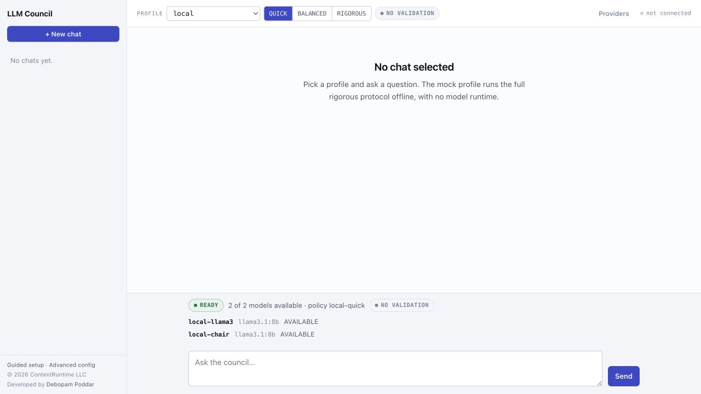
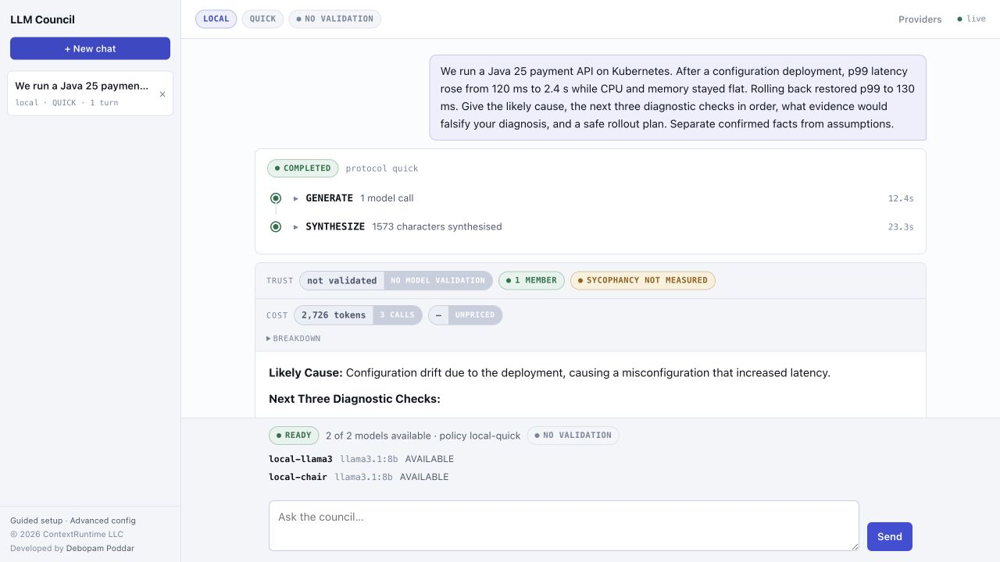
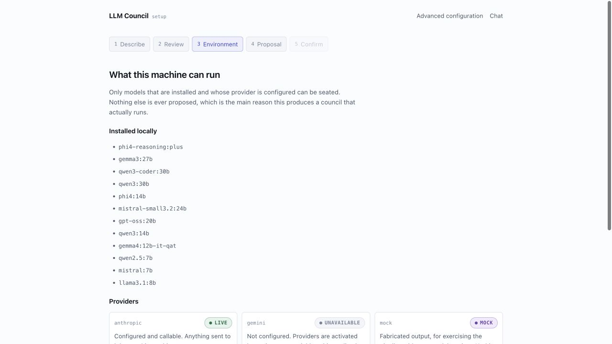
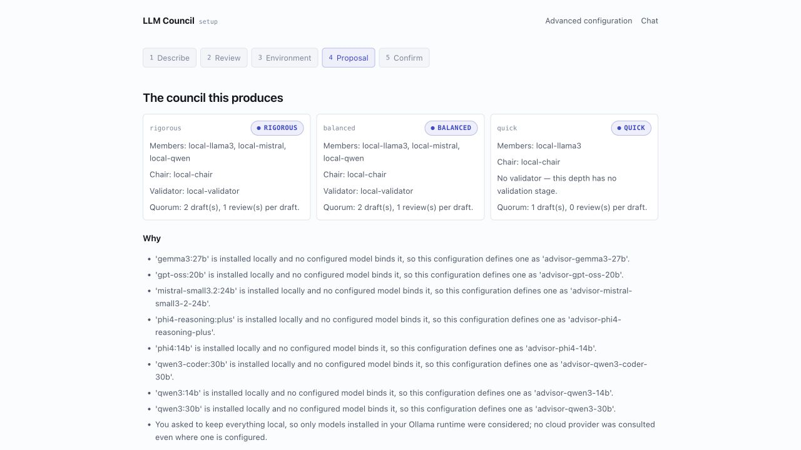

# Building an Inspectable LLM Council in Java

Most multi-model demos make an appealing promise: ask several models, let them
vote, and get a better answer. That is a useful experiment, but it leaves an
engineering problem unsolved. When the result is wrong, slow, partial, or
surprisingly confident, a final answer alone does not tell us what happened.

LLM Council is a Java 25 and Spring Boot application that treats a council as
an **inspectable protocol**, not as a black-box voting prompt. A caller chooses
a named profile and a depth (`QUICK`, `BALANCED`, or `RIGOROUS`). The application
then resolves that choice to configuration-owned policy; callers cannot select
or bypass a raw protocol. Depending on the selected depth, the protocol can
generate independent drafts, anonymise them for review, score them, debate
material disagreement, synthesise a response, and send that response to a
Fresh Eyes validator.

The important output is therefore more than a paragraph of generated text. It
is the answer **and** the visible evidence required to decide how much to trust
it.

> The application demonstrates observable multi-model orchestration. It does
> not claim that a council has been proven to outperform a strong one-call
> model. The independent evaluation work is designed to test that hypothesis.

## The practical problem: one answer hides too much

An LLM can produce a fluent answer when it has misread the question, inherited
an unsafe instruction from quoted context, run out of tokens, or simply had no
useful basis for confidence. Adding more model calls does not automatically fix
those problems. It can also make the failure harder to see.

LLM Council makes the protocol visible instead:

```text
question and context
  -> independent drafts
  -> anonymised review
  -> evidence scoring
  -> optional debate and revision
  -> chair synthesis
  -> Fresh Eyes validation
  -> answer plus audit trail
```

`QUICK` deliberately stays small: a generation and synthesis path with no
model-validation stage. `BALANCED` introduces review and validation.
`RIGOROUS` can add debate, revision, a second review, and another scoring pass
when its configured conditions are met. More depth means more calls, latency,
and cost; it is not a claim of automatic quality.

## A real local run starts with a health gate

The interface surfaces the selected profile, depth, available models, and
validation posture before the user spends a model call. This prevents a common
demo failure: presenting a “local” workflow that silently uses a different
provider or falls back to fabricated output.



*Figure 1 — The local `QUICK` policy is selected. The page reports two
available model roles and explicitly says that this depth has no validation
stage.*

The screenshot above was captured from commit
`3b79da91c9b478028a577c571957b58127cdc549` on 2026-08-27 using the local
Ollama profile. The active policy was `local-quick`; the roster shown was
`llama3.1:8b` for the member and chair roles.

## An answer should carry its execution context

For the demonstration, I asked a bounded operational question: a Java 25
payment API's p99 latency jumped immediately after a configuration deployment,
while CPU and memory remained flat and rollback restored the previous latency.
The requested response had to distinguish confirmed facts from assumptions,
propose three diagnostic checks, name falsifying evidence, and give a safe
rollout plan.

The result is intentionally not presented as a benchmark. It is one local,
`QUICK`-mode example. Its value is that the screen records the protocol that
produced it: completed stages, stage durations, model-call count, token usage,
validation status, number of members, and whether sycophancy or dissent could
actually be measured.



*Figure 2 — A live local run completed with `GENERATE` and `SYNTHESIZE` stages.
The trust strip says “not validated,” records one member, and says sycophancy
was not measured. Those are limits of the selected protocol, not decorative
metadata.*

This example used three calls, 2,726 reported tokens, and approximately 35.7
seconds across the two visible stages. Its `QUICK` result is useful for a fast
first pass; it is not evidence that the diagnosis is correct or that one model
has cross-checked another.

That distinction is intentional. A UI that labels “no validation” is safer than
one that allows users to infer a review that never happened. Similarly, when a
chair does not produce a labelled dissent section, the interface says that the
run has no record either way—it does not convert missing evidence into consensus.

## Configuration should be explainable before it is written

The Requirement Advisor does not let an LLM invent arbitrary provider IDs,
model IDs, or protocol stages. The model can help extract a small, closed set of
intent choices; deterministic Java then builds a proposal from the locally
available models and configured providers. Nothing is written until the user
reviews and confirms it.



*Figure 3 — The setup flow inventories what the machine can run. It does not
propose an uninstalled Ollama tag or put credentials in configuration.*

For a local-only request, the proposal explains its choices: it seats distinct
local model families, keeps the chair and validator local, and shows quorum and
validation behavior for each depth.



*Figure 4 — The local-only proposal makes the three depth policies concrete:
members, chair, validator, and quorum are visible before confirmation.*

The advanced configuration workbench is the complementary path for operators
who prefer YAML. It validates the server-owned schema, shows the merged catalog
diff and selectable profiles, requires confirmation against the exact validated
text, and keeps credentials outside the overlay contract.

## Troubleshooting: interpret the signals before retrying

| What you see | What it means | First response |
|---|---|---|
| `blocked` or an unavailable model in preflight | The selected policy cannot currently call every required role. | Check the chosen profile, the configured provider, and the locally installed model tags before submitting a run. |
| A partial run | The policy's quorum/partial-result rules allowed a result despite one or more unavailable or failed calls. | Read the stage evidence and warnings; do not treat partial as equivalent to a fully completed protocol. |
| `no validation` | The selected depth has no validation stage. | Use it as a fast path only. Move to a validating policy when that trade-off is appropriate. |
| `sycophancy not measured` or no preserved dissent | The protocol did not collect enough relevant evidence to calculate that signal. | Do not infer agreement. Inspect the selected depth, council size, and completed stages. |
| A malformed review is recovered or a stage is retried | Model output is untrusted and did not meet the structured contract on its first attempt. | Preserve the run artifacts and inspect the recovery/warning state instead of assuming the retry proves correctness. |
| A setup proposal excludes a model you expected | The advisor will only seat installed local models or configured providers. | Install/configure the dependency deliberately, then rebuild the proposal; do not hand-edit credentials into the YAML overlay. |

These signals are the reason to show more than the chat pane in a walkthrough.
They allow a reader to differentiate a healthy fast path from a degraded run,
a missing validation stage, or an unsupported inference about agreement.

## Trust boundaries are part of the product

LLM Council treats user intent as authoritative and supporting context or model
artifacts as untrusted data. Supporting context defaults to an evidence purpose
where complete instruction-bearing lines are removed before the first model
call. When the task is specifically to analyse quoted instructions, a separate
analysis-subject purpose preserves the text as an object of analysis; it does
not grant it instruction authority.

The project also uses bounded deterministic recovery for declared invariants,
such as malformed structured reviews or output that violates certain explicit
requirements. This is a narrow claim about checks the application can enforce,
not universal prompt-injection prevention or factual truth verification.

There is another operational boundary worth stating clearly: the default
binding is loopback. The service has no authentication, authorization, or
multi-tenant ownership model, and artifacts are not meant to be exposed to an
untrusted network. It is appropriate for controlled local use and engineering
study—not for public deployment as-is.

## Evaluation: a quality claim needs independent evidence

The separate
[LLM Council evaluation repository](https://github.com/debopampoddar/llm-council-evaluation)
contains the plan for comparing a council with a true direct-model baseline and
a same-model ensemble, including deterministic checks, blinded mirrored judging,
and human-review support.

The tracked historical local ablation did **not** establish a RIGOROUS advantage
over the direct or same-model-ensemble baselines. It also informed subsequent
hardening, so it is diagnostic history rather than confirmation for the current
code. Any future quality claim needs a fresh frozen dataset, judge families
outside the candidate paths, and blinded human review—not a green build or a
single impressive screenshot.

That result is not a weakness to hide. It is the right standard for an
engineering tool that asks people to rely on a generated answer.

## Try it locally

The quickest path requires Java 25, Maven 3.9 or newer, and a running Ollama
service. Pull the local tags named in the [project README](../README.md#quick-local-demo),
then run:

```bash
mvn --batch-mode --no-transfer-progress clean verify
java -jar target/llm-council-2.0.2.jar
```

Open `http://127.0.0.1:8080`, choose `local` and `QUICK`, and start with a
bounded question. Explore `BALANCED` or `RIGOROUS` only after the fast path is
healthy and you understand the added calls and evidence stages.

For a recorded walkthrough, use the companion
[screen-recording script](llm-council-blog-demo-recording.md). It uses the same
local question and capture order as the figures in this post, with explicit
redaction and claim-boundary checks.

## Closing thought

More model calls are not a substitute for evidence. A useful LLM council makes
its protocol, costs, partial states, disagreement signals, validation posture,
and security limits visible enough for an engineer to decide when to trust it—
and when not to.
