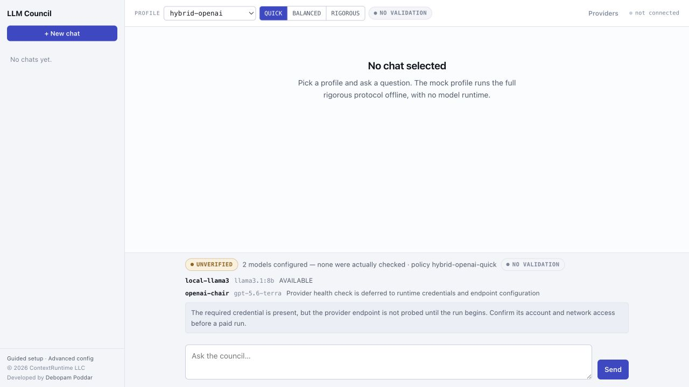
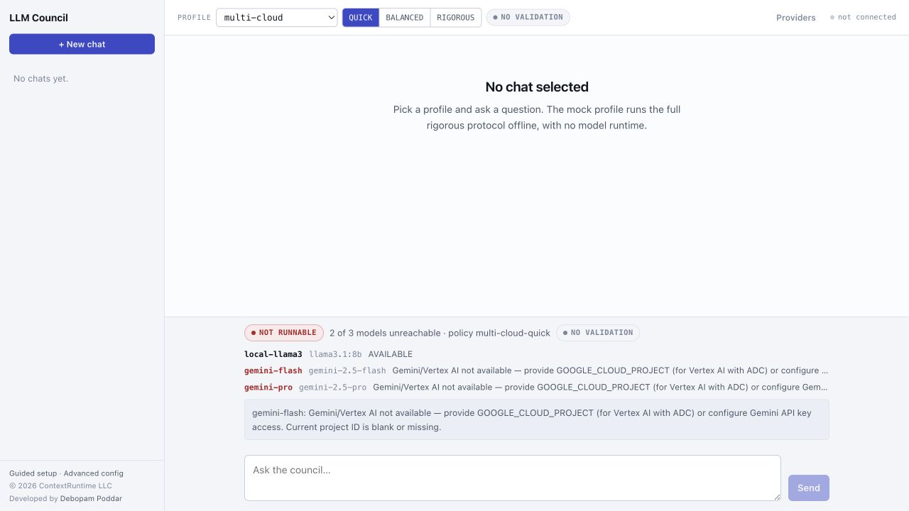

<!--
MEDIUM PUBLISHING NOTES — remove this comment before publishing.

Suggested title: I Built an LLM Council in Java. The Point Is Not More Answers.
Suggested subtitle: A practical Spring Boot utility for making model disagreement,
partial results, validation posture, and trust limits visible.
Suggested tags: Java, Spring Boot, LLM, AI Engineering, Software Architecture
Suggested cover: use the local-preflight screenshot after cropping it to show the
profile and health gate, or create a simple dark cover with the words
“Inspectable LLM Orchestration.”

For Medium, upload the current JPG captures from docs/assets/blog rather than relying on
the relative image paths below. Link the repository once in the introduction and
once in the closing call to action.
-->

# I Built an LLM Council in Java. The Point Is Not More Answers.

*A practical Spring Boot utility for making model disagreement, partial results,
validation posture, and trust limits visible.*

Most AI demos end at the exact point where I start asking questions.

The model gives a neat answer. It sounds reasonable. Maybe two or three models
were involved. The screen says “complete.” And then we are expected to trust it.

But if that answer will influence an engineering decision, I want to know a few
things that a polished paragraph cannot tell me:

- Did independent models actually see the question, or did one model's answer
  anchor the others?
- Did they disagree? If so, where and why?
- Did a validation step really run, and was it independent?
- Did a model fail or time out while the application quietly carried on?
- Is this a fast first pass, or a result that has gone through a deeper review?

That is why I built [LLM Council](https://github.com/debopampoddar/llm-council):
a Java 25 and Spring Boot utility for running a configurable council of language
models while preserving the evidence around the answer.

If you want to try it before reading the rest, the repository now starts with a
five-minute local path. Come back here when you want to understand why the
timeline and trust signals matter.

This is not an argument that “more models always produce a better answer.” That
would be an easy claim to make and a hard one to prove. The point is simpler:
when a system asks several models for help, the path from question to answer
should be visible enough for an engineer to judge what happened.

## What problem am I trying to solve?

Using one model is often the right choice. It is fast, cheap, and easy to
reason about. The trouble starts when the question is ambiguous, consequential,
or open to several plausible interpretations. Asking another model can help,
but it can also create a new kind of opacity: now there are several answers,
several prompts, and several possible failure points hidden behind one final
response.

The usual shortcut is “ask several models and let them vote.” I do not think
that is enough. A vote does not tell us whether the models saw the same evidence,
whether they copied one another, whether one participant failed, or whether the
winner was actually reviewed.

LLM Council turns that hidden process into an explicit protocol:

```text
question
  → independent drafts
  → anonymous review
  → scoring and disagreement checks
  → optional debate and revision
  → synthesis
  → Fresh Eyes validation
  → answer plus an audit trail
```

Not every question needs every step. The application exposes three depth modes:

- **QUICK** is a fast first pass. It generates and synthesises an answer, but it
  has no model-validation stage.
- **BALANCED** adds peer review and validation.
- **RIGOROUS** can add debate, revision, another review pass, and another score
  when the configured evidence says that disagreement matters.

The names describe the protocol, not a promise of correctness. More steps mean
more calls, more latency, and more cost. I want those trade-offs to be a
deliberate user choice rather than an invisible implementation detail.

## A council is useful only when you can see its limits

Here is the first screen I want a user to see before they send a prompt.


*The local `QUICK` profile is selected. The screen says which model roles are
available, which policy will run, and—equally important—that this depth has no
validation stage. This current capture also shows an honest health gate: Llama
is available, while the separate Granite chair has not yet been installed, so
Send is disabled rather than silently falling back.*

This may seem like a small design choice, but it changes the conversation.
“No validation” is not a warning the user has to discover after a bad answer.
It is a fact shown before spending a model call. The same is true for unavailable
models, partial results, and the degree of independence of a validator.

That is one of the main differences between LLM Council and a generic
multi-model chat wrapper. The goal is not merely to put several providers behind
one text box. The goal is to expose the protocol, its evidence, and its limits.

## A useful middle ground: local drafts, a cloud chair

Not every workflow is strictly local or fully cloud-based. The two hybrid
profiles make that choice explicit:

| Choose this | What stays local | What goes to the cloud |
|---|---|---|
| `hybrid-openai` | Drafting and, in validating depths, review | The original question and local drafts for OpenAI-led synthesis |
| `hybrid-claude` | Drafting and, in validating depths, review | The original question and local drafts for Anthropic-led synthesis |

This is not a privacy shortcut: a cloud chair must see enough context to do its
job. The interface therefore shows the profile and calls cloud access
*unverified* until a run or explicit probe confirms it. If the required
credential is missing, the run is blocked before a paid request.



*The hybrid profile makes the handoff visible: a local Llama drafter and an
OpenAI chair. The provider credential is configured on this capture, but the UI
does not pretend the endpoint has been checked. That distinction helps avoid a
surprise at run time.*

## Let’s use it on a realistic engineering question

To keep the demo practical, I used a synthetic incident-style question:

> We run a Java 25 payment API on Kubernetes. After a configuration deployment,
> p99 latency rose from 120 ms to 2.4 s while CPU and memory stayed flat.
> Rolling back restored p99 to 130 ms. Give the likely cause, the next three
> diagnostic checks in order, what evidence would falsify your diagnosis, and a
> safe rollout plan. Separate confirmed facts from assumptions.

This is a good council question because it invites a hypothesis but asks for
falsifying evidence. It is not asking the model to pronounce a fact. It is
asking it to help structure an investigation.

After installing the listed roles, look at the answer *and* the timeline: which
stages finished, whether validation ran, how many members participated, whether
any result was partial, plus calls, token use, and latency. Those are the facts
needed to understand the shape of a run without pretending an articulate answer
has been independently proven correct.

If I need a fast way to turn an incident description into a diagnostic plan,
this is a sensible first step. If I need a deeper cross-check, I can choose a
validating policy and inspect the extra review evidence. If a result is partial,
or if the system has no record of dissent, I should not turn absence of evidence
into evidence of agreement.

## Troubleshooting should be part of the product, not a separate hunt

The same preflight that catches a missing local model also catches a missing
provider requirement. In this fresh capture, `multi-cloud` is disabled because
Gemini has not been configured. Nothing has been sent to another provider.



*`multi-cloud` needs Gemini for this policy. The page names the missing setup
instead of trying a partial cloud topology or charging for a run that cannot
meet the selected profile.*

## What makes this different from “just use another prompt”?

Prompts are valuable, but a prompt alone cannot enforce an operating model. It
cannot reliably prevent someone from selecting an unsafe combination of models,
skipping quorum, or treating a missing validator as an independent one.

LLM Council puts those controls in the application:

| A common approach | What LLM Council adds |
|---|---|
| One chat completion | A visible policy, stage timeline, run artifacts, and a trust summary. |
| Several models in one prompt | Independent drafts, anonymised review, configured quorum, and measurable disagreement where the council is large enough. |
| “Let the agent decide” | A configuration-owned protocol. Callers select a profile and depth, not a raw internal protocol ID. |
| A model-generated YAML configuration | A Requirement Advisor where the model expresses closed-choice intent and deterministic Java builds and validates the proposal. |
| “The result passed validation” | Validation posture and independence signals shown alongside the answer. |
| Silent retries or fallbacks | Explicit unavailable-provider, partial, warning, and recovery states. |

The distinction matters because model output is untrusted input to the system,
not a permission slip. A language model can help draft, review, or describe a
desired configuration. It should not be allowed to invent arbitrary model IDs,
providers, or internal stages and have the application execute them blindly.

## Getting from this article to a working local run

You do not need cloud credentials to try the local path. You need Java 25,
Maven 3.9 or newer, and [Ollama](https://ollama.com/) running on your machine.

Clone the repository, then pull the drafting model and the separate chair model
needed for the first `QUICK` run:

```bash
ollama pull llama3.1:8b
ollama pull granite3.3:8b
```

When the first run works, add the models needed for deeper local policies:

```bash
ollama pull mistral:7b
ollama pull gemma4:12b-it-qat
ollama pull qwen2.5:7b
```

Build and start the application:

```bash
mvn --batch-mode --no-transfer-progress clean verify
java -jar target/llm-council-2.0.2.jar
```

Then open `http://127.0.0.1:8080` and follow this simple path:

1. Select the **local** profile.
2. Select **QUICK**.
3. Wait for the health gate to show the required roles as available.
4. Ask a bounded question with clear constraints. The incident example above is
   a good first run.
5. Read the stage timeline and trust strip before deciding how much to rely on
   the answer.

Start with `QUICK` on purpose. It gives you a small, understandable workflow.
Only move to `BALANCED` or `RIGOROUS` after the local fast path works and you
understand why you want the extra model calls. `BALANCED` needs `mistral:7b`
and `gemma4:12b-it-qat`; `RIGOROUS` also needs `qwen2.5:7b`.

## Configuration without the magic trick

Once the first run works, open the Guided setup page. Instead of asking you to
memorise model IDs and YAML fields, it asks what you care about: local-only or
cloud-capable, speed, cost, council size, and desired depth.

The important part happens next. The utility inventories the models installed
on the machine and the providers that are configured. It will not propose a
local model you have not pulled or a cloud provider that has not been set up.


*The setup flow is environment-aware. It is designed to propose a council that
can actually run, not a configuration that fails later.*

For example, a local-only request produces a proposal that names the drafting
members, chair, validator, and quorum for each depth. You can inspect why those
choices were made before anything is written.


*The proposal is reviewable before confirmation. The model helps express intent;
deterministic application logic owns the configuration.*

If you prefer to work directly with YAML, the advanced configuration workbench
is there too. It validates the server-owned schema, previews the merged catalog,
and requires explicit confirmation against the exact text it validated.

## A few things that will save you time

When you first experiment, do not treat every signal as an error.

If the health gate says a model is unavailable, fix the selected profile,
provider setup, or local model tag before running the question. The application
is deliberately refusing to hide a missing dependency behind fabricated output.

If a run is marked partial, read its warnings and stage evidence. A configured
quorum may allow a useful result even when a call failed, but partial is not the
same as a full protocol run.

If you see “no validation,” that is the expected behavior of `QUICK`. Use it for
speed, not as an independent cross-check. If you see “sycophancy not measured”
or no preserved dissent, do not infer that models agreed. It means the selected
run did not collect enough relevant evidence to calculate that signal.

Finally, keep the deployment boundary in mind. The application binds to
loopback by default and has no authentication or multi-tenant ownership model.
It is intended for controlled local use and engineering study. It is not a
public internet service as shipped.

## The claim I will not make

It would be tempting to end with “a council gives better answers.” I am not
making that claim.

The project has a separate
[evaluation harness](https://github.com/debopampoddar/llm-council-evaluation)
for comparing the council with a one-call direct baseline and a same-model
ensemble. The tracked historical local ablation did not establish a
`RIGOROUS` advantage, and the dataset later informed hardening work. That makes
it useful diagnostic history, not proof for the current code.

Any future quality claim needs fresh held-out data, independent judging, and
blinded human review. A green build, a completed run, or a fluent screenshot is
not enough.

I see that as a feature of the project, not an apology for it. Good AI
engineering is not about making uncertainty disappear. It is about making
uncertainty visible, bounded, and easier to reason about.

## Try it, then inspect it

If you build Java services and are exploring practical LLM orchestration, start
with the repository:

> [github.com/debopampoddar/llm-council](https://github.com/debopampoddar/llm-council)

Run the local `QUICK` path. Watch the health gate. Ask one bounded engineering
question. Read the timeline and trust strip before you read the answer as if it
were truth.

That small habit—treating the answer and the evidence around it as one
deliverable—is the capability I wanted this utility to showcase.
